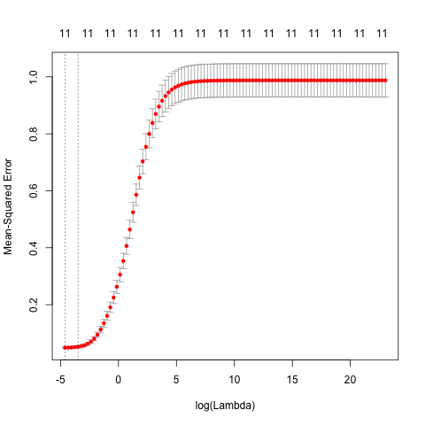
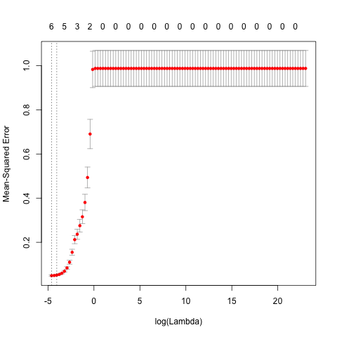
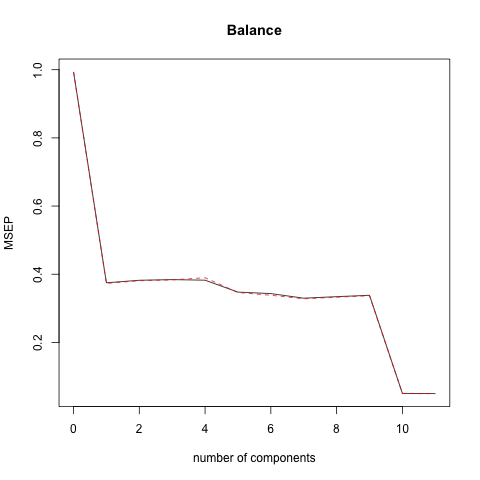
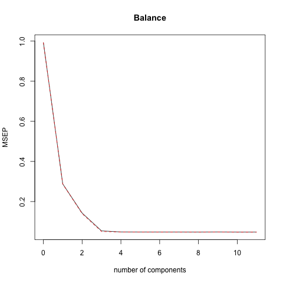

```{r, echo = FALSE, include = FALSE, eval=TRUE}
# load the necessary data files and required packages
scaled_credit <- read.csv("../data/datasets/scaled-credit.csv")
load("../data/output/ols-regression.RData")
load("../data/output/lasso-regression.RData")
load("../data/output/ridge-regression.RData")
load("../data/output/pc-regression.RData")
load("../data/output/pls-regression.RData")

# packages
library(xtable)
library(png)
library(grid)
library(ggplot2)
library(reshape)
library(Matrix)
library(knitr)
```

## Introduction
- In this project, we will recreate the predictive modeling process in Chapter 6: Linear Model Selection and Regularization of the book [**An Introduction to Statistical Learning**](http://www-bcf.usc.edu/~gareth/ISL/).
- We will be using multiple regression models on the _Credit_ dataset and compare the differences between these models.


## Data

- Variables
    - Predictor Variables
        - quantitative: age, cards, income, limit, education, and rating
        - qualitative: gender, student, status, ethnicity
    - Response Variable
        - quantitative: balance
        

## Pre-Modeling Data Processing
There are two major processing steps we took to prepare the data:

- Dummy out categorical variables
    - Transforming categorical variable into dummy variables
```
temp_credit <- model.matrix(Balance ~ ., data = credit)
new_credit <- cbind(temp_credit[ ,-1], Balance = credit$Balance)
```


- Mean centering and standardizing
    - each variable will have mean zero, and standard deviation one to have comparable scales
```
scaled_credit <- scale(new_credit, center = TRUE, scale = TRUE)
```


## Preparing Training and Testing Data
In order to evaluate the models, we will take a random sample of the data for model building and use the rest to understand the model performance.

- **training set**: generate a random sample of size 300. Use sample() function and an integer vector 1:400 to sample 300 values
- **testing set**: rest of 100 observations not included in the train set
  
  
## Regression Models
- Ordinary Least Squares Regression (OLS)
- Shrinkage Methods
    - Ridge Regression
    - Lasso Regression
- Dimension Reduction Methods
    - Principal Components Regression (PCR)
    - Partial Least Squares Regression (PLSR)
  
  
## OLS

- Minimizing the RSS in order to minimize the error of the prediction

$$Sales \approx \beta_0 + \beta_1*Income+ \beta_2*Limit + \dots + \beta_11*EthnicityCaucasian$$


## Ridge Regression

- Shrinkage method
- Add a tuing parameter based on OLS
- Flexibility of ridge regression decreases with increases in tuning parameter

$$RSS + \lambda\sum_{j=1}^{p}\beta_j^{2}$$


## Lasso Regression

- Shinkage method
- Will result in estimations of coefficients to zero

$$\sum_{i=1}^{n}(y_i-\beta_0-\sum_{j=1}^{p}\beta_jx_{ij})^2+\lambda\sum_{j=1}^{p}|\beta_j|$$


## PCR

PCR is a dimension reduction technique for regression that involves constructing the first $M$ principal components, $Z_1 + \dots + Z_{M*}$, and then using these components as the predictors in a linear regression model that is fit using least squares.


## PLSR

- An extension of PCR

$$Z_1=\sum_{j=1}^p\phi_{j1}X_j$$

# Analysis

## OLS

- Benchmark for comparison
- Education, Gender, Martial Status and Ethnicity has big p-value， thus not statitiscally significant.
- Income, Limit, and Rating have large and statistically significant coefficients.


## Ridge

- The smallest validation error is $\lambda$ = `r ridge_min_lambda`.
- Small $\lambda$
- Similar coefficients with OLS, expect the larger Rating coefficients.


## Ridge

This is the image for ridge cross validation errors.
<center>

</center>


## Lasso

- $\lambda$ = `r lasso_min_lambda`
- Six of the coefficients are set to zero
- Smaller coefficients than OLS

## Lasso

The graph for lasso cross-validation errors:
<center>

</center>


## PCR

- The best M is `r lambda_min_pc`.
- Almost same coefficients with OLS and PLSR.
- Coefficients also similar to Ridge and Lasso.

## PCR

This is the MSE plot for PCR:
<center>

</center>

## PLSR

- The best M is `r lambda_min_pls`.
- Almost same to OLS and PCR.
- Similar to Ridge.


## PLSR

This is the MSE plot for PLSR:
<center>

</center>

## Results

This is the table for MSE of all regression models:
```{r results= 'asis', echo = FALSE,eval=TRUE}
library(knitr)
names <- c("ols","ridge","lasso","pcr","plsr")
mse <- c(ols_mse, ridge_mse, lasso_mse, pc_mse, pls_mse)
mse.matrix <-data.frame(names,mse)
kable(mse.matrix, caption = 'MSE of Five Regression Methods',align=c('c','c'))
```


## MSE

- Close to one another
- lasso has the largest MSE `r lasso_mse`, ols the least `r ols_mse`
- ols the best fit model, lasso the worst fit model

## Results

This the trendline plot for each type of regression models fit on Credit.csv:
```{r results= 'asis', echo = FALSE,eval=TRUE}
library(knitr)
library(xtable)
scaled_credit <- read.csv("../data/datasets/scaled-credit.csv")
scaled_credit$X <- NULL

Variables <- c("Intercept", "Income","Limit", "Rating", "Cards", "Age", "Education", "GenderFemale", "StudentYes", "MarriedYes", "EthnicityAsian", "EthnicityCaucasian")
OLS <- as.vector(ols_coefficients)
Ridge <- as.vector(ridge_coefficients)
Lasso <- as.vector(lasso_coefficients)
PCR <- as.vector(pc_coef_full)
PCR <- append(PCR, 0, 0)
PLSR <- as.vector(pls_coef_full)
PLSR <- append(PLSR, 0, 0)

five_matrix_coef <- data.frame(Variables, OLS, Ridge, Lasso, PCR, PLSR)

par(mfrow = c(1,1))
plot(five_matrix_coef[,2], xaxt = "n",xlab=" ", ylab = "Value", main = "Trend Lines of Coefficients for Five Regression Models", col = "black")
lines(five_matrix_coef[,2], col="black", lwd=2)
points(five_matrix_coef[,3],col= "red")
lines(five_matrix_coef[,3],col = "red")
points(five_matrix_coef[,4], col = "green")
lines(five_matrix_coef[,4],col = "green")
points(five_matrix_coef[,5], col = "yellow")
lines(five_matrix_coef[,5],col = "yellow")
points(five_matrix_coef[,6], col = "blue")
lines(five_matrix_coef[,6],col = "blue")
axis(1, at=1:12, labels=Variables, las=2,cex.axis=0.6)
legend(10,0.9,c('OLS','Ridge','Lasso','PCR','PLSR'), lty = c(1,1,1,1,1), lwd = c(2.5,2.5,2.5,2.5,2.5), col = c("black","red","green","yellow","blue"),merge = T)
abline(h = 0, lty = 3)
```


## Official Coefficients

- Lasso with largest variation
- PLSR, OLSR and PCR have the almost same coefficients


## Conclusions

- OLS is the best fit model to Credit dataset.
- Income, Limit, and Rating are statistically and economiclly significant across five models.
- Lasso is the worst fit model to Credit dataset.
